# 系统架构文档

## 整体架构图


## 请求处理流程


## 认证流程


## 权限控制流程


## 数据模型关系图


## 项目分层架构

```mermaid
graph TD
    subgraph "表示层"
        A[Gin Router] --> B[API Handlers]
    end

    subgraph "中间件层"
        C[Recovery] --> D[Logger]
        D --> E[CORS]
        E --> F[JWT Auth]
        F --> G[Casbin Auth]
    end

    subgraph "业务逻辑层"
        H[User Service]
        I[Role Service]
        J[Permission Service]
    end

    subgraph "数据访问层"
        K[GORM] --> L[PostgreSQL]
        M[Redis Client] --> N[Redis]
    end

    subgraph "权限控制层"
        O[Casbin Enforcer] --> P[GORM Adapter]
        P --> L
    end

    B --> C
    G --> H
    G --> I
    G --> J
    H --> K
    I --> K
    J --> K
    H --> M
    F --> O
    G --> O
```



## 目录结构详解

```
app/server/
│
├── api/                      # API 处理器层
│   ├── auth.go              # 负责用户认证相关的 HTTP 请求处理
│   ├── user.go              # 负责用户管理相关的 HTTP 请求处理
│   ├── role.go              # 负责角色管理相关的 HTTP 请求处理
│   └── permission.go        # 负责权限管理相关的 HTTP 请求处理
│
├── config/                   # 配置管理
│   └── config.go            # 配置加载、环境变量读取
│
├── database/                 # 数据库层
│   ├── postgres.go          # PostgreSQL 连接和配置
│   ├── redis.go             # Redis 连接和配置
│   └── migrate.go           # 数据库迁移脚本
│
├── middleware/               # 中间件层
│   ├── jwt.go               # JWT Token 生成、验证
│   ├── casbin.go            # Casbin 权限验证
│   ├── cors.go              # CORS 跨域处理
│   ├── logger.go            # 请求日志记录
│   └── recovery.go          # Panic 异常恢复
│
├── model/                    # 数据模型
│   └── user.go              # User、Role、Permission 实体定义
│
├── rbac/                     # 权限控制
│   └── enforcer.go          # Casbin Enforcer 初始化和操作
│
├── router/                   # 路由配置
│   └── router.go            # 路由注册、中间件绑定
│
├── service/                  # 业务逻辑层
│   ├── user_service.go      # 用户相关业务逻辑
│   ├── role_service.go      # 角色相关业务逻辑
│   └── permission_service.go # 权限相关业务逻辑
│
└── command.go                # CLI 命令实现
```

## 核心组件说明

### 1. Gin Router

- **职责**: HTTP 路由和请求分发
- **特点**: 高性能、简洁的 API
- **配置**: 支持 debug/release 模式

### 2. JWT 认证

- **算法**: HS256
- **有效期**: 可配置（默认 24 小时）
- **存储**: Token 包含用户 ID、用户名、角色列表

### 3. Casbin RBAC

- **模型**: RBAC（基于角色的访问控制）
- **存储**: PostgreSQL（通过 GORM Adapter）
- **特点**: 支持动态权限更新

### 4. GORM

- **版本**: v1.31.0
- **特性**:
  - 自动迁移
  - 预加载
  - 软删除
  - 关联查询

### 5. Redis

- **用途**:
  - 缓存（预留）
  - Session 管理（预留）
  - 限流（预留）

## 安全机制

### 1. 密码安全

- bcrypt 加密（cost 14）
- 永不返回密码字段

### 2. Token 安全

- JWT 签名验证
- 过期时间控制
- Bearer Token 格式

### 3. 权限安全

- 路由级别权限控制
- 角色继承支持
- 细粒度资源访问

### 4. 数据安全

- GORM 防 SQL 注入
- 参数验证
- 软删除机制

## 性能优化

### 1. 数据库优化

- 连接池配置
- 索引优化
- 预加载关联数据
- 批量操作

### 2. 缓存策略

- Redis 连接池
- 查询结果缓存（预留）

### 3. 并发控制

- Goroutine 池（Gin 内置）
- 数据库连接池

## 可扩展性

### 横向扩展

- 无状态设计
- 支持负载均衡
- 支持分布式部署

### 垂直扩展

- 模块化设计
- 接口化编程
- 依赖注入

### 功能扩展

- 插件式中间件
- 可配置的权限模型
- 灵活的数据模型

## 监控和日志

### 日志系统

- 结构化日志（slog）
- 请求日志记录
- 错误日志记录

### 健康检查

- `/api/health` 端点
- 数据库连接检查
- Redis 连接检查

## 部署架构


## 总结

本架构设计具有以下特点：

✅ **清晰的分层结构**: 便于理解和维护  
✅ **高度模块化**: 各组件职责明确  
✅ **可扩展性强**: 支持水平和垂直扩展  
✅ **安全性高**: 多层安全防护  
✅ **性能优化**: 连接池、缓存等机制  
✅ **易于测试**: 接口化设计，便于 Mock

适合作为**企业级应用**的基础架构。
