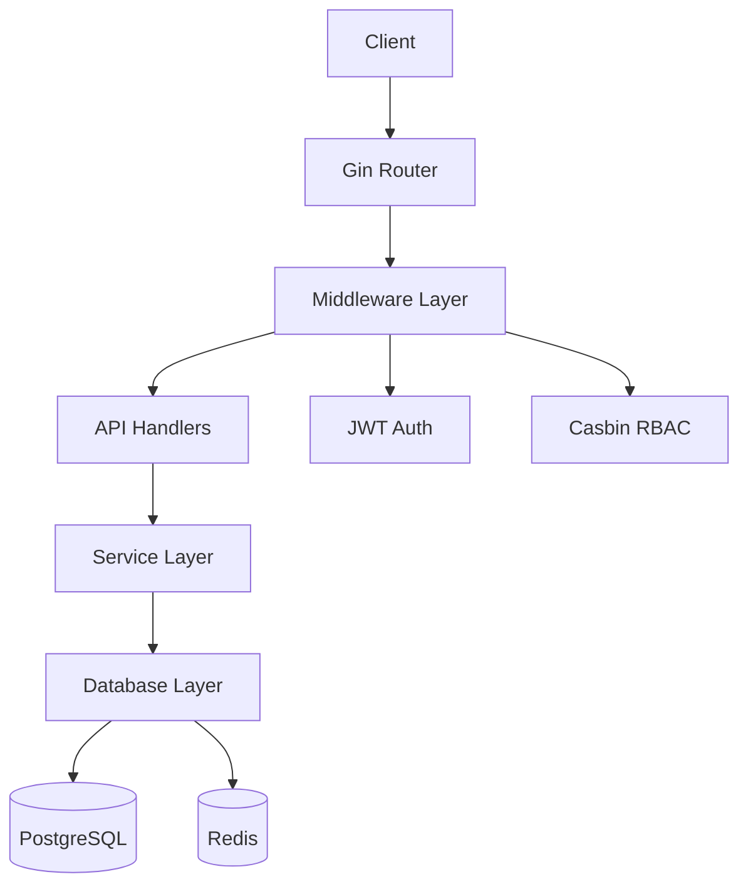

# REST API 设计文档

## 架构概述

本项目采用 **Gin + Casbin + PostgreSQL + Redis** 构建 REST API 服务。

### 技术栈

- **Web框架**: Gin (高性能 HTTP 框架)
- **权限控制**: Casbin (RBAC 基于角色的访问控制)
- **数据库**: PostgreSQL (主数据存储)
- **缓存**: Redis (缓存和会话管理)
- **ORM**: GORM (数据库操作)
- **认证**: JWT (JSON Web Token)

### 项目结构



## 核心功能

### 1. 认证系统 (Authentication)

#### 注册
- **Endpoint**: `POST /api/auth/register`
- **功能**: 用户注册，默认分配 `user` 角色

#### 登录
- **Endpoint**: `POST /api/auth/login`
- **功能**: 用户登录，返回 JWT Token

#### 获取个人信息
- **Endpoint**: `GET /api/users/profile`
- **功能**: 获取当前登录用户信息
- **需要**: JWT 认证

### 2. 用户管理 (User Management)

- `GET /api/users` - 获取用户列表（分页）
- `GET /api/users/:id` - 获取指定用户
- `POST /api/users` - 创建用户
- `PUT /api/users/:id` - 更新用户
- `DELETE /api/users/:id` - 删除用户
- `POST /api/users/:id/roles` - 为用户分配角色

**权限要求**: 需要 `admin` 角色

### 3. 角色管理 (Role Management)

- `GET /api/roles` - 获取角色列表
- `GET /api/roles/:id` - 获取指定角色
- `POST /api/roles` - 创建角色
- `PUT /api/roles/:id` - 更新角色
- `DELETE /api/roles/:id` - 删除角色
- `POST /api/roles/:id/permissions` - 为角色分配权限

**权限要求**: 需要 `admin` 角色

### 4. 权限管理 (Permission Management)

- `GET /api/permissions` - 获取权限列表
- `GET /api/permissions/:id` - 获取指定权限
- `POST /api/permissions` - 创建权限
- `PUT /api/permissions/:id` - 更新权限
- `DELETE /api/permissions/:id` - 删除权限

**权限要求**: 需要 `admin` 角色

## 权限模型

### RBAC 模型

采用 Casbin RBAC 模型，支持：
- 角色继承
- 资源访问控制
- 操作级别权限

### 默认角色

| 角色 | 描述 | 权限 |
|-----|------|-----|
| admin | 管理员 | 所有 API 访问权限 |
| user | 普通用户 | 个人资料、仪表板 |
| guest | 访客 | 公开资源访问 |

## 中间件

### 1. Logger (日志中间件)
记录所有请求的详细信息（方法、路径、耗时、状态码等）

### 2. Recovery (异常恢复)
捕获 panic 并返回友好的错误信息

### 3. CORS (跨域)
处理跨域请求

### 4. JWT Auth (JWT认证)
验证 JWT Token 的有效性

### 5. Casbin Auth (权限验证)
基于 Casbin 的 RBAC 权限验证

## 数据模型

### User (用户)
```go
- ID
- Username (唯一)
- Email (唯一)
- Password (加密存储)
- Nickname
- Avatar
- Status
- Roles (多对多)
```

### Role (角色)
```go
- ID
- Name (唯一)
- DisplayName
- Description
- Status
- Users (多对多)
- Permissions (多对多)
```

### Permission (权限)
```go
- ID
- Name (唯一)
- DisplayName
- Description
- Resource (资源路径)
- Action (操作: GET, POST, PUT, DELETE)
```

## 快速开始

### 1. 启动依赖服务
```bash
docker-compose up -d
```

### 2. 运行数据库迁移
```bash
go run main.go server migrate
```

### 3. 启动服务器（带初始化）
```bash
go run main.go server start --migrate --init-policy
```

### 4. 测试 API
```bash
# 注册
curl -X POST http://localhost:8080/api/auth/register \
  -H "Content-Type: application/json" \
  -d '{"username":"test","email":"test@example.com","password":"123456"}'

# 登录
curl -X POST http://localhost:8080/api/auth/login \
  -H "Content-Type: application/json" \
  -d '{"username":"test","password":"123456"}'

# 获取个人信息（需要 Token）
curl -X GET http://localhost:8080/api/users/profile \
  -H "Authorization: Bearer YOUR_TOKEN"
```

## 环境变量

参考 `.env.example` 文件配置环境变量。

## API 响应格式

### 成功响应
```json
{
  "code": 200,
  "message": "成功",
  "data": {}
}
```

### 错误响应
```json
{
  "code": 400,
  "message": "错误信息",
  "error": "详细错误"
}
```

## 安全建议

1. **生产环境**必须修改 `JWT_SECRET`
2. 使用强密码策略
3. 启用 HTTPS
4. 定期更新依赖包
5. 限制 API 访问频率
6. 记录和监控异常访问

