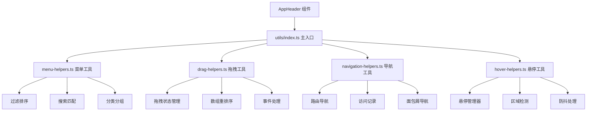

# AppHeader 组件架构说明

## 📁 目录结构

```
components/AppHeader/
├── index.vue                    # 主组件文件
├── types.ts                     # 📋 类型定义
├── stores/
│   └── index.ts                # 📦 状态管理
├── utils/                      # 🛠️ 组件专用工具函数
│   ├── index.ts                # 工具函数主入口
│   └── title-helpers.ts        # 页面标题管理工具
└── components/                 # 🧩 子组件目录
    ├── AllPagesMenuItem.vue    # 所有页面菜单项
    ├── FavoriteMenu.vue        # 收藏菜单组件
    ├── ProductsPanel.vue       # 产品面板组件
    └── RecentPagesMenuItem.vue # 最近访问菜单项
```

## 🎯 各文件职责分工

### 📋 types.ts - 类型定义

- **作用**: 定义组件属性和数据结构，统一管理所有类型定义
- **内容**:
  ```typescript
  // Vue Router 扩展
  declare module 'vue-router' {
    interface RouteMeta {
      title: string
      icon?: string
      // ...
    }
  }
  
  // 组件属性
  interface Props {
    title?: string
    showDrawer?: boolean
    drawerWidth?: number | string
    // ...
  }
  
  // 菜单项类型
  interface RouteMenuItem {
    title: string
    path: string
    icon: string
    // ...
  }
  
  // 配置类型
  interface TitleConfig {
    defaultTitle?: string
    appName?: string
    // ...
  }
  ```

### 📦 stores/index.ts - 状态管理

- **作用**: 管理头部导航、抽屉菜单和悬停状态
- **内容**:
  ```typescript
  export const useAppHeaderStore = defineStore('appHeader', () => {
    const drawerOpen = ref(false)
    const hoveredItem = ref<string | null>(null)
    // ...
  })
  ```

### 🛠️ utils/ - 组件专用工具函数

专门为 AppHeader 组件提供的工具函数库：

#### utils/title-helpers.ts - 页面标题管理工具

- **作用**: 管理浏览器页面标题的显示和格式化
- **主要功能**:
  - `TitleConfig` 接口 - 标题配置选项
  - `PageTitleManager` 类 - 页面标题管理器
  - `pageTitleManager` 实例 - 默认标题管理器
  - `setPageTitle()` - 设置页面标题快捷函数
- **使用示例**:

  ```typescript
  import { setPageTitle } from './utils'

  // 设置页面标题
  setPageTitle('仪表板')

  // 自定义格式
  setPageTitle('登录', { showAppName: false })
  ```

### 🧩 子组件说明

#### AllPagesMenuItem.vue

- 显示"所有页面"菜单项
- 支持悬停效果和图标动画
- 触发产品面板显示

#### FavoriteMenu.vue

- 管理收藏的页面列表
- 支持拖拽排序功能
- 提供收藏/取消收藏操作

#### ProductsPanel.vue

- 显示所有页面的分类视图
- 支持按分类组织页面
- 提供快速导航和收藏功能

#### RecentPagesMenuItem.vue

- 显示最近访问的页面
- 自动记录访问历史
- 提供快速跳转功能

## 💡 组件特性

### ✅ 功能特点

- 🎨 响应式头部导航栏
- 📱 可折叠的抽屉菜单
- 🌟 页面收藏功能
- 📝 最近访问记录
- 🎯 悬停展开的产品面板
- ⚙️ 高度可配置的外观

### 🎛️ 配置选项

| 属性          | 类型             | 默认值            | 说明             |
| ------------- | ---------------- | ----------------- | ---------------- |
| `title`       | `string`         | `'控制台'`        | 头部标题文本     |
| `titleIcon`   | `string`         | `'mdi-console'`   | 头部标题图标     |
| `showTitle`   | `boolean`        | `true`            | 是否显示标题     |
| `showNavIcon` | `boolean`        | `true`            | 是否显示导航图标 |
| `navIcon`     | `string`         | `'mdi-menu'`      | 导航图标         |
| `showDrawer`  | `boolean`        | `true`            | 是否启用抽屉菜单 |
| `drawerWidth` | `number\|string` | `240`             | 抽屉宽度         |
| `elevation`   | `number\|string` | `2`               | 头部阴影级别     |
| `color`       | `string`         | `'grey-darken-4'` | 头部背景色       |
| `height`      | `number\|string` | `50`              | 头部高度         |

## 🚀 使用方式

### 基础用法

```vue
<template>
  <AppHeader />
</template>
```

### 高级配置

```vue
<template>
  <AppHeader
    title="我的应用"
    title-icon="mdi-application"
    :drawer-width="280"
    color="primary"
    :height="60"
  />
</template>
```

### 自定义内容

```vue
<template>
  <AppHeader :use-custom-content="true">
    <template #custom-content>
      <v-spacer />
      <v-btn color="white" variant="text"> 自定义按钮 </v-btn>
    </template>
  </AppHeader>
</template>
```

### 使用 Store 管理状态

```typescript
import { useAppHeaderStore } from '@/components/AppHeader/stores'

const headerStore = useAppHeaderStore()

// 控制抽屉
headerStore.toggleDrawer()

// 设置悬停项
headerStore.setHoveredItem('all-products')

// 更新配置
headerStore.updateDrawerConfig({ width: 300 })

// 页面标题管理
headerStore.setCurrentPageTitle('自定义标题')
headerStore.setPageTitleByPath('/dashboard')

// 路由菜单操作
headerStore.toggleFavorite('/dashboard')
const recentPages = headerStore.recentItems
```

### 使用工具函数

AppHeader 组件提供了专用的工具函数库，可以在组件内部或其他地方使用：

#### 菜单项处理工具

```typescript
import { MenuHelpers } from '@/components/AppHeader/utils'

// 过滤菜单项
const filteredItems = MenuHelpers.filterMenuItems(allItems, {
  category: ['仪表板', '用户管理'],
  keyword: '搜索关键词',
})

// 排序菜单项
const sortedItems = MenuHelpers.sortMenuItems(filteredItems, {
  field: 'priority',
  order: 'asc',
})

// 按分类分组
const groupedItems = MenuHelpers.groupMenuItemsByCategory(sortedItems)
```

#### 拖拽排序工具

```typescript
import { DragHelpers } from '@/components/AppHeader/utils'

// 创建拖拽处理器
const dragHandler = DragHelpers.createDragHandler(favoriteItems, 'path', (newOrder) => {
  // 处理重新排序后的结果
  updateFavoriteOrder(newOrder)
})

// 在模板中使用
const dragClasses = DragHelpers.getDragClasses(item, dragHandler.dragState, 'path')
```

#### 导航工具

```typescript
import { NavigationHelpers } from '@/components/AppHeader/utils'

// 安全导航
await NavigationHelpers.navigateTo(router, '/dashboard', {
  beforeNavigate: async (path) => {
    // 导航前检查
    return await checkPermission(path)
  },
  afterNavigate: (path) => {
    // 导航后处理
    trackPageView(path)
  },
})

// 创建访问记录管理器
const accessTracker = NavigationHelpers.createAccessTracker()
accessTracker.recordAccess('/dashboard', '仪表板')
const recentPages = accessTracker.getRecentAccess(5)
```

#### 悬停状态管理工具

```typescript
import { HoverHelpers } from '@/components/AppHeader/utils'

// 创建悬停管理器
const hoverManager = HoverHelpers.createHoverManager(
  { showDelay: 200, hideDelay: 500 },
  {
    onHoverStart: (itemId) => console.log('开始悬停:', itemId),
    onHoverEnd: (itemId) => console.log('结束悬停:', itemId),
  },
)

// 处理悬停事件
hoverManager.handleMouseEnter('menu-item-1')
hoverManager.handleMouseLeave('menu-item-1')
```

### 页面标题管理

AppHeader Store 集成了页面标题管理功能，可以方便地控制浏览器标题栏显示：

```typescript
import { useAppHeaderStore } from '@/components/AppHeader/stores'

const headerStore = useAppHeaderStore()

// 设置当前页面标题
headerStore.setCurrentPageTitle('自定义标题')

// 根据路由路径设置标题
headerStore.setPageTitleByPath('/dashboard')

// 使用临时配置设置标题
headerStore.setCurrentPageTitle('无后缀标题', {
  showAppName: false,
})
```

页面标题会自动根据路由变化更新，默认格式为：`页面标题 - Vue + Vuetify Console`

## 🔧 开发指南

### 添加新的菜单项

1. 在 `components/` 目录创建新的菜单项组件
2. 在 `index.vue` 中引入并注册
3. 在 `types.ts` 中添加相应的类型定义
4. 在 Store 中添加相关状态管理逻辑

### 自定义悬停面板

1. 在 `components/` 目录创建面板组件
2. 在 `index.vue` 的悬停面板区域添加条件渲染
3. 在 Store 中添加面板状态管理

### 使用工具函数开发

#### 添加新的工具函数

1. 确定工具函数的类别（菜单、拖拽、导航、悬停）
2. 在对应的 `utils/xxx-helpers.ts` 文件中添加函数
3. 在 `utils/index.ts` 中导出新函数
4. 添加 TypeScript 类型定义
5. 在组件中导入使用

#### 工具函数最佳实践

- **单一职责**: 每个工具函数只处理一个特定任务
- **类型安全**: 为所有函数参数和返回值提供类型定义
- **错误处理**: 在函数内部处理可能的错误情况
- **文档注释**: 为每个函数提供详细的 JSDoc 注释
- **测试友好**: 函数设计应便于单元测试

#### 示例：添加新的菜单工具函数

```typescript
// 在 utils/menu-helpers.ts 中添加
/**
 * 根据用户角色过滤菜单项
 * @param items - 菜单项列表
 * @param userRole - 用户角色
 * @returns 过滤后的菜单项
 */
export function filterByUserRole(items: RouteMenuItem[], userRole: string): RouteMenuItem[] {
  return items.filter((item) => {
    // 实现角色过滤逻辑
    return item.allowedRoles?.includes(userRole) || !item.allowedRoles
  })
}

// 在 utils/index.ts 中导出
export { filterByUserRole } from './menu-helpers'

// 在组件中使用
import { filterByUserRole } from '@/components/AppHeader/utils'
const userMenuItems = filterByUserRole(allMenuItems, currentUserRole)
```

### 样式自定义

组件使用 Vuetify 的主题系统，可以通过以下方式自定义：

```vue
<style scoped>
/* 自定义抽屉样式 */
:deep(.v-navigation-drawer) {
  /* 你的样式 */
}

/* 自定义悬停面板 */
.hover-panel {
  /* 你的样式 */
}
</style>
```

### 工具函数架构说明


