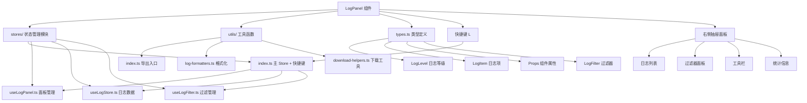

# LogPanel 组件架构说明

## 📁 目录结构

```
components/LogPanel/
├── index.vue                    # 主组件文件
├── types.ts                     # 📋 类型定义
├── stores/                     # 📦 状态管理模块
│   ├── index.ts                # 主 Store + 导出模块
│   ├── useLogPanel.ts          # 面板状态管理
│   ├── useLogStore.ts          # 日志数据管理
│   └── useLogFilter.ts         # 日志过滤管理
├── utils/                      # 🛠️ 组件专用工具函数
│   ├── index.ts                # 工具函数主入口
│   ├── log-formatters.ts       # 日志格式化工具
│   └── download-helpers.ts     # 文件下载工具
└── README.md                   # 📖 组件文档
```

## 🎯 各文件职责分工

### 📋 types.ts - 类型定义

- **作用**: 定义组件属性和数据结构，统一管理所有类型定义
- **内容**:

  ```typescript
  // 日志等级枚举
  export enum LogLevel {
    DEBUG = 'debug',
    INFO = 'info',
    WARN = 'warn',
    ERROR = 'error',
  }

  // 日志项接口
  interface LogItem {
    id: string
    timestamp: number
    level: LogLevel
    message: string
    category?: string
    source?: string
    details?: any
    stack?: string
  }

  // 组件属性接口
  interface Props {
    showPanel?: boolean
    width?: number | string
    color?: string
    // ...
  }
  ```

### 📦 stores/ - 状态管理模块

采用模块化设计，按功能拆分为多个 Composables：

#### stores/index.ts - 主 Store + 导出模块 (100+行)

- **作用**: 组合各功能模块创建主 Store，集成键盘快捷键处理
- **内容**:

  ```typescript
  // 主 Store - 组合各个功能模块
  export const useLogPanelStore = defineStore('logPanel', () => {
    const panel = useLogPanel()
    const logStore = useLogStore()
    const logFilter = useLogFilter()

    // 键盘快捷键处理
    const setupKeyboardShortcut = () => {
      // 监听 L 键切换面板
    }

    return { ...panel, ...logStore, ...logFilter }
  })
  ```

#### stores/useLogPanel.ts - 面板状态管理 (60+行)

- **作用**: 管理面板开关、显示配置
- **主要功能**: `togglePanel()`, `openPanel()`, `closePanel()`, `updatePanelConfig()`

#### stores/useLogStore.ts - 日志数据管理 (200+行)

- **作用**: 管理日志数据的增删改查、导出功能
- **主要功能**:
  - `addLog()`, `debug()`, `info()`, `warn()`, `error()`
  - `clearLogs()`, `removeLog()`, `searchLogs()`
  - `exportLogs()`, `getLogsByLevel()`

#### stores/useLogFilter.ts - 日志过滤管理 (150+行)

- **作用**: 提供日志过滤功能，支持多维度筛选
- **主要功能**:
  - `applyFilter()`, `setLevelFilter()`, `setCategoryFilter()`
  - `setKeywordFilter()`, `clearAllFilters()`, `getPresetFilters()`

### 🛠️ utils/ - 组件专用工具函数

专门为 LogPanel 组件提供的工具函数库：

#### utils/log-formatters.ts - 日志格式化工具

- **作用**: 处理日志的显示格式化和样式
- **主要功能**:
  - `formatTimestamp()` - 时间格式化
  - `getLogLevelColor()` - 根据级别获取颜色
  - `getLogLevelIcon()` - 根据级别获取图标
  - `formatLogMessage()` - 消息格式化
  - `highlightKeyword()` - 关键词高亮

#### utils/download-helpers.ts - 文件下载工具

- **作用**: 提供日志导出和文件下载功能
- **主要功能**:
  - `downloadJsonFile()` - 下载JSON格式
  - `downloadCsvFile()` - 下载CSV格式
  - `downloadTextFile()` - 下载文本格式
  - `copyToClipboard()` - 复制到剪贴板
  - `generateTimestampedFilename()` - 生成带时间戳的文件名

## 💡 组件特性

### ✅ 功能特点

- 🚀 右侧抽屉式弹出面板
- ⌨️ 快捷键 **L** 快速切换显示
- 📊 多级别日志支持（Debug, Info, Warn, Error）
- 🔍 强大的搜索和过滤功能
- 📤 多格式导出（JSON, CSV, TXT）
- 📋 一键复制日志内容
- 🎨 美观的日志级别颜色区分
- 📱 响应式设计，适配移动端
- 🔄 实时日志统计显示
- 💾 自动滚动到最新日志

### 🎛️ 配置选项

| 属性           | 类型             | 默认值            | 说明             |
| -------------- | ---------------- | ----------------- | ---------------- |
| `showPanel`    | `boolean`        | `false`           | 是否显示面板     |
| `width`        | `number\|string` | `400`             | 面板宽度         |
| `color`        | `string`         | `'grey-darken-4'` | 面板背景色       |
| `elevation`    | `number\|string` | `4`               | 面板阴影级别     |
| `maxLogs`      | `number`         | `1000`            | 最大日志数量     |
| `autoScroll`   | `boolean`        | `true`            | 是否自动滚动     |
| `enableFilter` | `boolean`        | `true`            | 是否启用过滤功能 |
| `enableClear`  | `boolean`        | `true`            | 是否启用清空功能 |
| `enableExport` | `boolean`        | `true`            | 是否启用导出功能 |

## 🚀 使用方式

### 基础用法

```vue
<template>
  <LogPanel />
</template>

<script setup>
import LogPanel from '@/components/LogPanel/index.vue'
</script>
```

### 高级配置

```vue
<template>
  <LogPanel
    :width="500"
    :max-logs="2000"
    :auto-scroll="false"
    color="grey-darken-3"
    :elevation="8"
  />
</template>
```

### 使用 Store 管理日志

```typescript
import { useLogPanelStore } from '@/components/LogPanel/stores'

const logPanel = useLogPanelStore()

// 记录不同级别的日志
logPanel.debug('调试信息', { category: 'Debug', source: 'Component' })
logPanel.info('系统启动完成', { category: 'System', source: 'Main' })
logPanel.warn('网络连接缓慢', { category: 'Network', source: 'API' })
logPanel.error('数据库连接失败', {
  category: 'Database',
  source: 'Connection',
  details: { error: 'Connection timeout', retry: 3 },
})

// 控制面板显示
logPanel.togglePanel() // 切换面板显示
logPanel.openPanel() // 打开面板
logPanel.closePanel() // 关闭面板

// 日志操作
logPanel.clearLogs() // 清空所有日志
logPanel.searchLogs('错误') // 搜索日志

// 过滤操作
logPanel.setLevelFilter([LogLevel.ERROR, LogLevel.WARN]) // 只显示错误和警告
logPanel.setCategoryFilter(['System', 'Network']) // 按分类过滤
logPanel.clearAllFilters() // 清空所有过滤器

// 导出功能
logPanel.exportLogs({ format: 'json', includeDetails: true })
```

### 快捷方式

```typescript
// 使用便捷的 log 对象
const { log } = useLogPanelStore()

log.debug('调试消息')
log.info('信息消息')
log.warn('警告消息')
log.error('错误消息')
```

## 🔧 开发指南

### 自定义日志格式

```typescript
// 扩展日志项属性
logPanel.addLog(LogLevel.INFO, '自定义日志', {
  category: '自定义分类',
  source: '自定义来源',
  details: { customField: 'customValue' },
  stack: 'stack trace here...',
})
```

### 过滤器预设

```typescript
const presets = logPanel.getPresetFilters()

// 只显示错误
presets.errorsOnly()

// 显示警告和错误
presets.warningsAndErrors()

// 显示最近一小时的日志
presets.lastHour()

// 显示最近24小时的日志
presets.last24Hours()
```

### 自定义导出格式

```typescript
// 导出特定时间范围的日志
logPanel.exportLogs({
  format: 'json',
  includeDetails: true,
  dateRange: {
    start: new Date('2024-01-01'),
    end: new Date('2024-01-31'),
  },
  levels: [LogLevel.ERROR, LogLevel.WARN],
})
```

## 📱 键盘快捷键

| 按键 | 功能         | 说明                          |
| ---- | ------------ | ----------------------------- |
| `L`  | 切换日志面板 | 在非输入状态下按 L 键切换面板 |

## 🎨 样式自定义

```vue
<style>
/* 自定义日志面板样式 */
:deep(.log-panel-drawer) {
  /* 自定义抽屉样式 */
}

/* 自定义日志项样式 */
:deep(.log-item) {
  /* 自定义日志项样式 */
}

/* 自定义高亮样式 */
.highlight {
  background-color: yellow;
  font-weight: bold;
}
</style>
```

## 🔄 实时集成示例

在应用中集成实时日志记录：

```typescript
// 在路由守卫中记录导航日志
router.beforeEach((to, from, next) => {
  logPanel.info(`导航到: ${to.path}`, {
    category: 'Navigation',
    source: 'Router',
    details: { from: from.path, to: to.path },
  })
  next()
})

// 在API请求中记录日志
const api = {
  async request(url: string) {
    logPanel.debug(`API请求: ${url}`, { category: 'HTTP', source: 'API' })
    try {
      const response = await fetch(url)
      logPanel.info(`API响应: ${response.status}`, {
        category: 'HTTP',
        source: 'API',
        details: { url, status: response.status },
      })
      return response
    } catch (error) {
      logPanel.error(`API错误: ${error.message}`, {
        category: 'HTTP',
        source: 'API',
        details: { url, error: error.message },
        stack: error.stack,
      })
      throw error
    }
  },
}

// 在Vue组件中记录生命周期
onMounted(() => {
  logPanel.debug('组件已挂载', { category: 'Vue', source: 'Component' })
})

onUnmounted(() => {
  logPanel.debug('组件已卸载', { category: 'Vue', source: 'Component' })
})
```

## 📊 性能优化

- **日志数量限制**: 自动清理超出限制的旧日志
- **虚拟滚动**: 大量日志时的性能优化
- **防抖搜索**: 搜索输入防抖处理
- **懒加载**: 详情弹窗按需加载内容

## 🚨 注意事项

1. **内存管理**: 大量日志可能占用内存，建议设置合理的 `maxLogs` 值
2. **敏感信息**: 避免在日志中记录敏感信息（密码、token等）
3. **性能影响**: 频繁的日志记录可能影响应用性能
4. **浏览器兼容**: 某些高级功能（如剪贴板API）在旧浏览器中可能不支持

## 组件架构图


