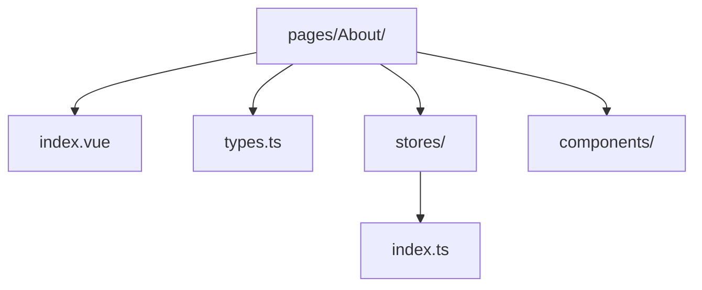
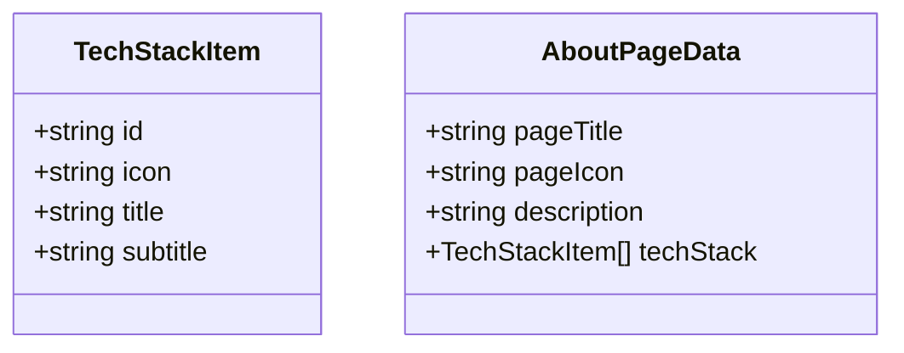
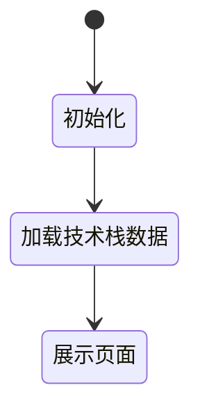
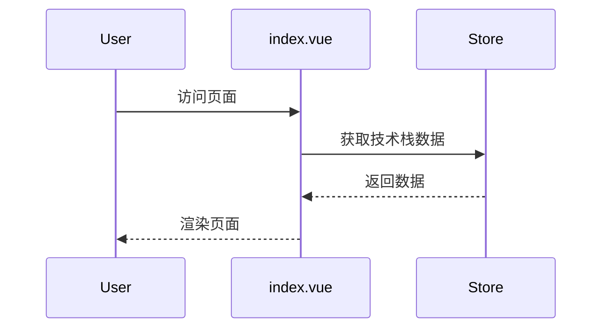

# About 页面架构说明

## 📁 目录结构

```mermaid
graph TD
    A[pages/About/] --> B[index.vue]
    A --> C[types.ts]
    A --> D[stores/]
    A --> E[components/]
    D --> F[index.ts]
```

## 🎯 页面职责

展示应用的技术栈和项目信息

## 📋 类型定义 (types.ts)

```mermaid
classDiagram
    class TechStackItem {
        +string id
        +string icon
        +string title
        +string subtitle
    }

    class AboutPageData {
        +string pageTitle
        +string pageIcon
        +string description
        +TechStackItem[] techStack
    }
```

## 📦 状态管理 (stores/index.ts)

```mermaid
stateDiagram-v2
    [*] --> 初始化
    初始化 --> 加载技术栈数据
    加载技术栈数据 --> 展示页面
```

## 🔄 数据流

```mermaid
sequenceDiagram
    participant U as User
    participant V as index.vue
    participant S as Store

    U->>V: 访问页面
    V->>S: 获取技术栈数据
    S-->>V: 返回数据
    V-->>U: 渲染页面
```
