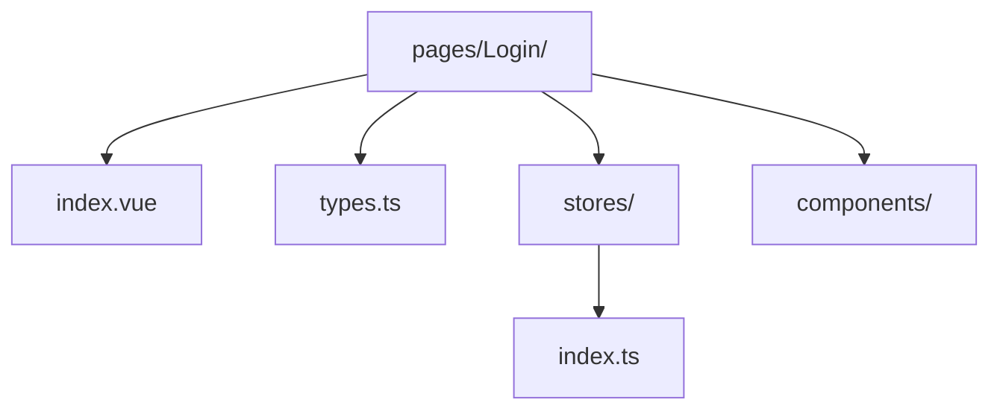
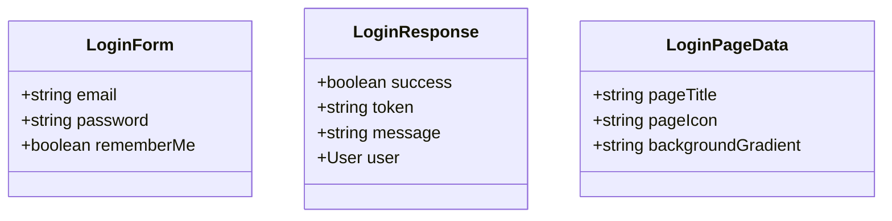
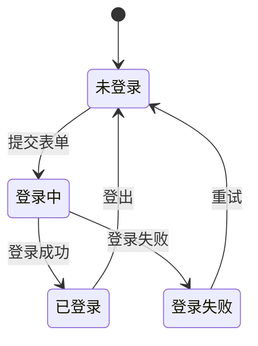
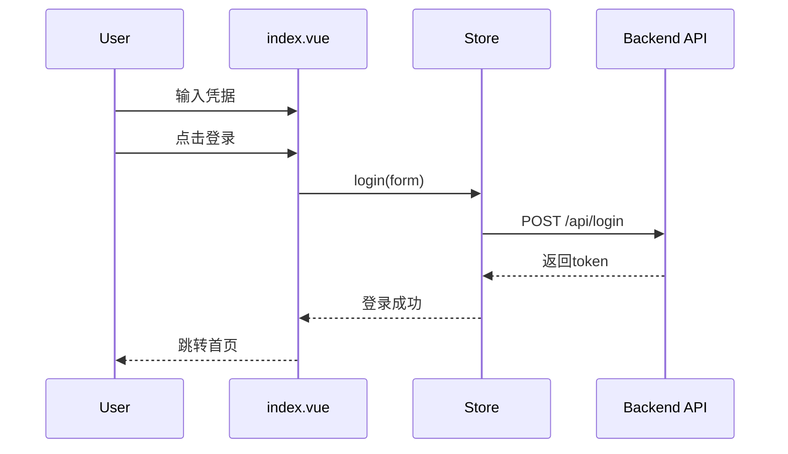

# Login 页面架构说明

## 📁 目录结构

```mermaid
graph TD
    A[pages/Login/] --> B[index.vue]
    A --> C[types.ts]
    A --> D[stores/]
    A --> E[components/]
    D --> F[index.ts]
```

## 🎯 页面职责

提供用户登录功能

## 📋 类型定义 (types.ts)

```mermaid
classDiagram
    class LoginForm {
        +string email
        +string password
        +boolean rememberMe
    }

    class LoginResponse {
        +boolean success
        +string token
        +string message
        +User user
    }

    class LoginPageData {
        +string pageTitle
        +string pageIcon
        +string backgroundGradient
    }
```

## 📦 状态管理 (stores/index.ts)

```mermaid
stateDiagram-v2
    [*] --> 未登录
    未登录 --> 登录中: 提交表单
    登录中 --> 已登录: 登录成功
    登录中 --> 登录失败: 登录失败
    登录失败 --> 未登录: 重试
    已登录 --> 未登录: 登出
```

## 🔄 数据流

```mermaid
sequenceDiagram
    participant U as User
    participant V as index.vue
    participant S as Store
    participant API as Backend API

    U->>V: 输入凭据
    U->>V: 点击登录
    V->>S: login(form)
    S->>API: POST /api/login
    API-->>S: 返回token
    S-->>V: 登录成功
    V-->>U: 跳转首页
```
