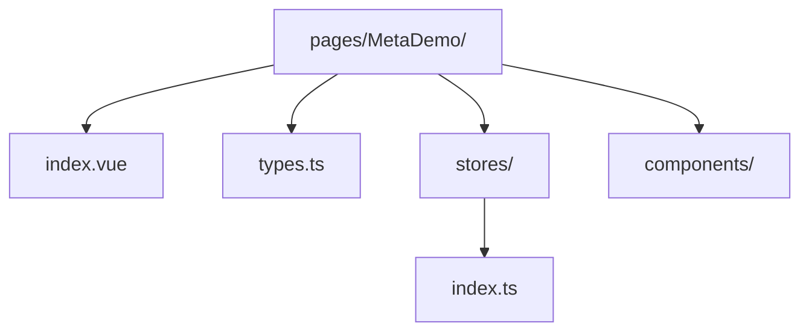
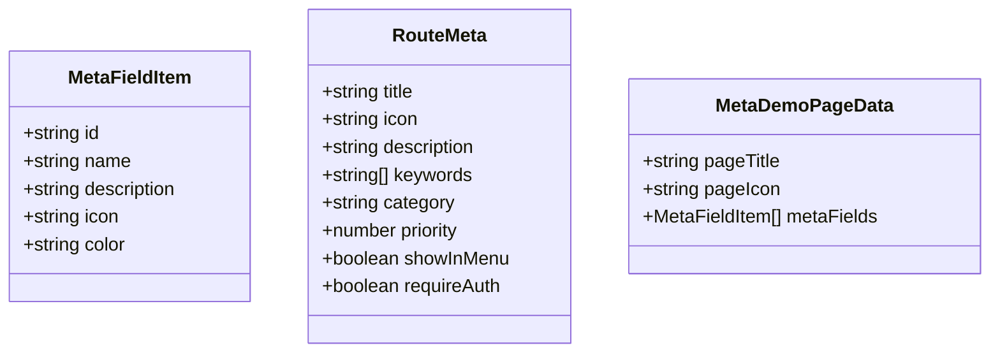
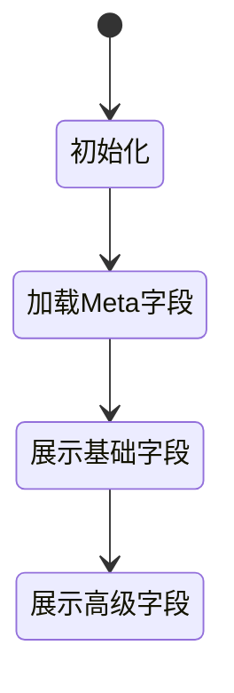
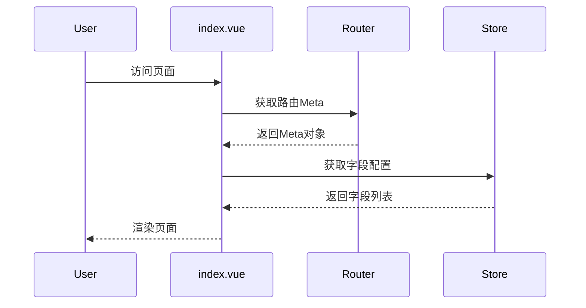

# MetaDemo 页面架构说明

## 📁 目录结构

## 🎯 页面职责

演示路由 Meta 自定义字段的使用方法

## 📋 类型定义 (types.ts)

## 📦 状态管理 (stores/index.ts)

## 🔄 数据流

## 💡 Meta字段说明

### 基础字段

- `title`: 页面标题
- `icon`: 页面图标
- `description`: 页面描述
- `keywords`: 关键词数组

### 高级字段

- `category`: 页面分类
- `priority`: 优先级
- `showInMenu`: 是否在菜单中显示
- `requireAuth`: 是否需要认证
