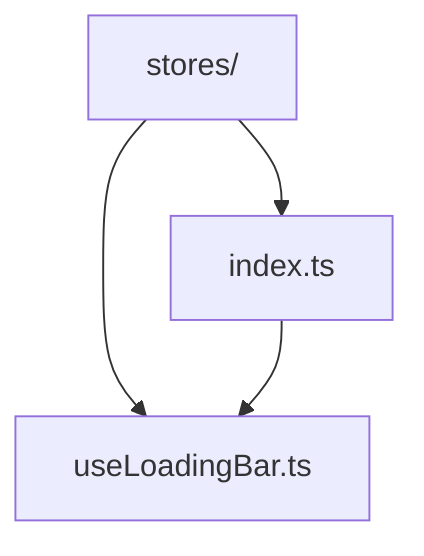
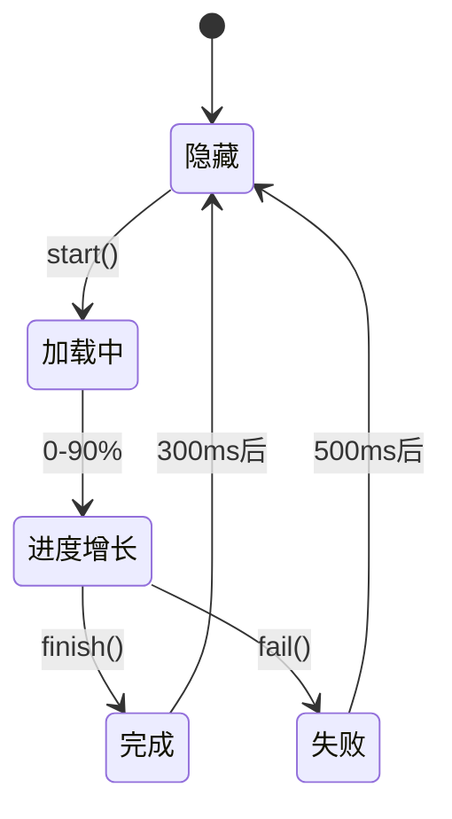
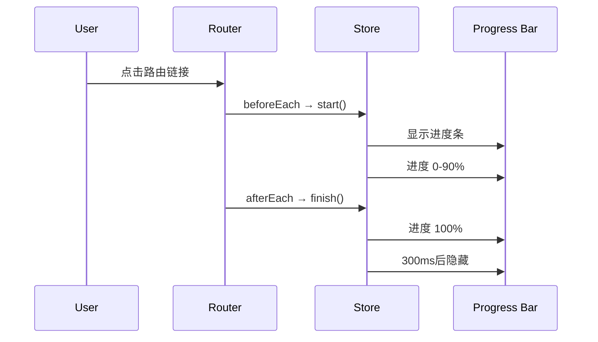

# 全局 Stores

全局状态管理，用于跨组件共享的应用级状态。

## 📁 目录结构



## 🎯 Stores 列表

### useLoadingBar - 路由加载进度条

管理顶部线性进度条的显示和进度状态。

#### 功能特性

- ✅ 自动跟踪路由切换
- ✅ 平滑的进度动画
- ✅ 支持成功/失败状态
- ✅ 可自定义颜色
- ✅ Material Design 风格

#### 状态流转



#### 使用方法

```typescript
import { useLoadingBar } from '@/stores'

const loadingBar = useLoadingBar()

// 开始加载
loadingBar.start()

// 完成加载
loadingBar.finish()

// 加载失败
loadingBar.fail()

// 重置状态
loadingBar.reset()
```

#### 自动集成

已在路由守卫中自动集成，无需手动调用：

```typescript
// router/index.ts
router.beforeEach((to, from, next) => {
  loadingBar.start() // 自动开始
  next()
})

router.afterEach(() => {
  loadingBar.finish() // 自动完成
})

router.onError(() => {
  loadingBar.fail() // 自动失败
})
```

## 🔄 数据流



## 💡 设计说明

### 为什么使用全局 Store？

- **单一职责**: 页面级 Store 管理页面状态，全局 Store 管理应用级状态
- **易于维护**: 路由加载是全局行为，不属于任何单个页面
- **可复用性**: 其他全局功能（如通知、主题等）也可以放在这里

### 进度条特性

- **智能速度**: 0-90% 快速增长，90-100% 等待实际加载
- **平滑动画**: 使用定时器模拟自然的进度效果
- **错误提示**: 加载失败时显示红色进度条
- **自动隐藏**: 完成后延迟隐藏，让用户看到完成动画
